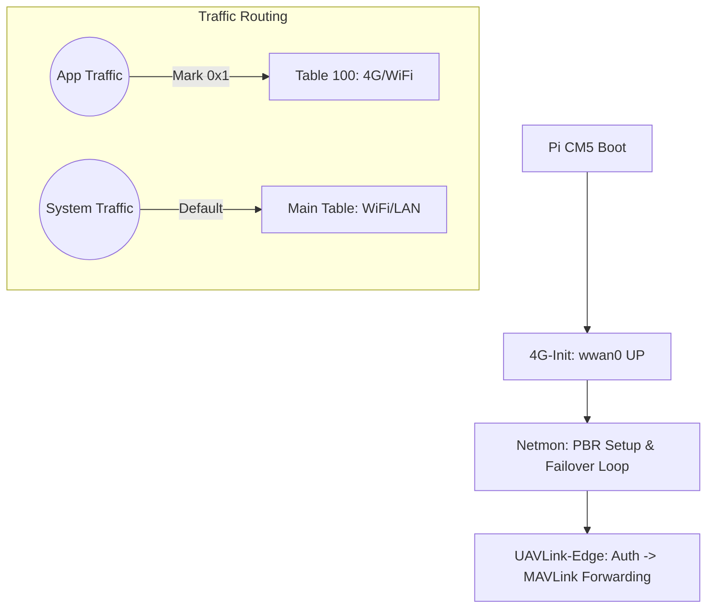

# 🚁 UAVLink-Edge Service — Pi CM5 Edition

**UAVLink-Edge Service** là giải pháp truyền tải dữ liệu MAVLink hiệu năng cao dành riêng cho nền tảng **Raspberry Pi CM5**, đóng vai trò là cầu nối (Bridge) thông minh giữa Drone và hệ thống **Fleet Server**.


---

## 🌟 Tính Năng Cốt Lõi

*   **Kết nối MAVLink Siêu Ổn Định**: Truyền tải dữ liệu telemetry và điều khiển trực tiếp qua giao thức TCP/UDP tối ưu hóa cho đường truyền **4G (wwan0)**.
*   **Cơ chế Fail-over Thông Minh**: Tự động chuyển đổi giữa 4G và WiFi. Ưu tiên 4G, chỉ fallback sang WiFi khi mất sóng và tự động quay lại khi có tín hiệu.
*   **Policy-Based Routing (PBR)**: Tách biệt hoàn toàn traffic ứng dụng và traffic hệ thống. Giữ kết nối SSH qua WiFi luôn ổn định kể cả khi UAVLink-Edge đang sử dụng 4G.
*   **Bảo Mật Xác Thực**: Thực hiện xác thực thiết bị với Fleet Server qua kênh TCP bảo mật trước khi bắt đầu chuyển tiếp dữ liệu.

---

## 🏗️ Kiến Trúc Hệ Thống (3 Tầng)

Hệ thống được vận hành bởi 3 dịch vụ phối hợp nhịp nhàng:

| Tầng | Dịch vụ (Systemd) | Chức năng chính |
| :--- | :--- | :--- |
| **1. Hardware** | `UAVLink-Edge-4g-init` | Khởi tạo modem 4G (QMI), cấp phát IP cho `wwan0`. |
| **2. Policy** | `UAVLink-Edge-netmon` | Quản lý bảng định tuyến (Table 100) và thực hiện Fail-over. |
| **3. Application** | `UAVLink-Edge` | Xử lý MAVLink, thực hiện Authentication và Forwarding. |



---

## 🚀 Hướng Dẫn Cài Đặt & Triển Khai

### 1. Deploy tự động (Khuyên dùng)
Sử dụng script `deploy.sh` từ máy tính quản trị (Ubuntu/Debian) để build và cài đặt từ xa:

```bash
chmod +x deploy.sh
./deploy.sh pi@<pi-ip-address>
```
*Script sẽ tự động: Build binary → Sync source → Cài đặt Services → Cấu hình PBR.*

### 2. Cấu Hình Hệ Thống
Chỉnh sửa file `config.yaml` để khai báo API Key và địa chỉ Fleet Server:

```yaml
fleet_server: "http://your-fleet-server.com"
api_key: "your-api-key-here"
```

---

## 🛠️ Quản Lý & Vận Hành

### Kiểm tra trạng thái nhanh
Hệ thống cung cấp công cụ kiểm tra trạng thái mạng và định tuyến chi tiết:
```bash
sudo python3 /opt/UAVLink-Edge/Module_4G/connection_manager.py status
```

### Quản lý dịch vụ (Systemd)
```bash
# Xem trạng thái tất cả services liên quan
sudo systemctl status "UAVLink-Edge*"

# Restart toàn bộ hệ thống UAVLink-Edge
sudo systemctl restart "UAVLink-Edge*"
```

### Theo dõi Log Real-time
| Mục tiêu log | Lệnh |
| :--- | :--- |
| **App Logic** | `journalctl -u UAVLink-Edge -f` |
| **Network/Failover** | `journalctl -u UAVLink-Edge-netmon -f` |
| **4G Hardware** | `journalctl -u UAVLink-Edge-4g-init -f` |

---

## 🔍 Xử Lý Sự Cố (Troubleshooting)

| Vấn đề | Nguyên nhân khả thi | Cách khắc phục |
| :--- | :--- | :--- |
| **Mất kết nối SSH khi bật app** | PBR chưa được cấu hình hoặc IP Rule bị mất. | Chạy `sudo /opt/UAVLink-Edge/setup_pbr.sh` hoặc restart `netmon`. |
| **Auth Timeout trên 4G** | Firewall chặn hoặc routing sai Table. | Kiểm tra `ip rule show` xem có fwmark 0x1 không. |
| **MAVLink bị trễ (Latency)** | Đang chạy trên WiFi yếu thay vì 4G. | Kiểm tra status netmon, force restart 4G-init. |

---

## 📁 Cấu Trúc Thư Mục Tham Chiếu

*   `/opt/UAVLink-Edge/`: Thư mục cài đặt chính.
*   `config.yaml`: File cấu hình hệ thống (IP, Port, API Key).
*   `Module_4G/`: Chứa scripts quản lý phần cứng và routing.
*   `docs/`: Tài liệu chi tiết về kiến trúc ([STARTUP_FLOW.md](docs/STARTUP_FLOW.md), [NETWORK_MANAGEMENT.md](docs/NETWORK_MANAGEMENT.md)).
*   `logs/`: Lưu trữ log sự kiện mạng và binary logs.

---
*© 2026 Fleet Control Station. All rights reserved.*
